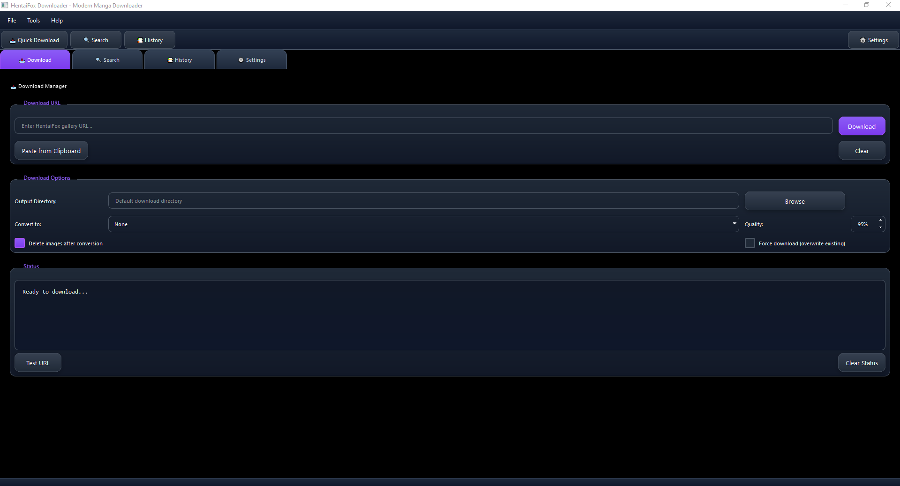

# 🎯 HentaiFox Downloader

A beautiful, modern manga downloader for HentaiFox with both **CLI** and **GUI** interfaces, featuring **Aria2c integration** for blazing-fast downloads, **parallel processing**, and **PDF/CBZ conversion** for the ultimate manga experience.



## 🔗 Repository
**GitHub**: [github.com/Yui007/hentaifox_downloader](https://github.com/Yui007/hentaifox_downloader)

## �️ Icnterface Preview

The application features a **stunning modern GUI** with:
- 🎨 **Beautiful gradient backgrounds** - Slate blue to dark gradients
- 💜 **Purple accent colors** - Modern, professional styling  
- 🔄 **Smooth animations** - Hover effects and transitions
- 📱 **Responsive design** - Clean, organized layout
- 🌙 **Dark theme** - Easy on the eyes for long sessions

## 📚 Documentation
- **[Complete Usage Guide](usage.md)** - Comprehensive CLI commands and examples
- **[GUI Guide](GUI_README.md)** - Modern PyQt6 interface documentation
- **[Performance Guide](PERFORMANCE_GUIDE.md)** - Optimization and benchmarking
- **[Conversion Guide](CONVERSION_GUIDE.md)** - PDF/CBZ conversion details

## ✨ Features

### 🖥️ **Dual Interface**
- **🎨 Modern GUI** - Beautiful PyQt6 interface with dark theme and gradients
- **⚡ Powerful CLI** - Full-featured command-line interface with interactive mode
- **� Semamless Integration** - Both interfaces share the same powerful backend

### � *i*Performance & Speed**
- **⚡ Aria2c Integration** - Up to 4x faster downloads with multi-connection support
- **� Turblo Mode** - One-click performance optimization (16 connections, 4 parallel galleries)
- **⚙️ Parallel Processing** - Download multiple galleries simultaneously
- **🎯 Smart Connection Pooling** - Efficient resource usage and retry logic

### 📚 **Content Management**
- **🔍 Advanced Search** - Search by title, tag, artist with pagination support
- **📖 Gallery Info** - Detailed metadata extraction and preview
- **📊 Download History** - SQLite database with statistics and search
- **🗂️ Smart Organization** - Configurable folder structures and naming

### 🎨 **Conversion & Output**
- **📄 PDF Conversion** - High-quality PDF generation with customizable settings
- **📦 CBZ Support** - Comic Book ZIP format for comic readers
- **🗑️ Auto-cleanup** - Optional deletion of source images after conversion
- **⚙️ Quality Control** - Adjustable image quality and optimization

## 🚀 Quick Start

### Installation

1. **Clone the repository:**
```bash
git clone https://github.com/Yui007/hentaifox_downloader.git
cd hentaifox_downloader
```

2. **Install dependencies:**
```bash
pip install -r requirements.txt
```

3. **Install Aria2c for fast downloads (recommended):**
   - **Windows:** Download from [aria2.github.io](https://aria2.github.io/)
   - **macOS:** `brew install aria2`
   - **Linux:** `sudo apt install aria2` (or equivalent)

4. **Setup HentaiFox Downloader:**
```bash
python -m cli.main setup
python -m cli.main test  # Test all components
```

### Basic Usage

**Download a single gallery:**
```bash
python -m cli.main download gallery https://hentaifox.com/gallery/12345/
```

**Download and convert to PDF:**
```bash
python -m cli.main download gallery https://hentaifox.com/gallery/12345/ --convert pdf --delete-images
```

**Enable turbo mode for faster downloads:**
```bash
python -m cli.main perf turbo
```

**Set up auto-conversion:**
```bash
python -m cli.main convert auto pdf --delete-source
```

**Search for galleries:**
```bash
python -m cli.main search query "your search term"
python -m cli.main search tag "tag-name"
```

**View download history:**
```bash
python -m cli.main history
python -m cli.main stats
```

## 📋 All Commands

### Download Commands
- `download gallery <url>` - Download single gallery
- `download gallery <url> --convert pdf` - Download and convert to PDF
- `download gallery <url> --convert cbz --delete-images` - Download, convert to CBZ, delete images
- `download batch <urls...>` - Download multiple galleries

### Conversion Commands
- `convert gallery <path> --format pdf` - Convert existing gallery to PDF
- `convert batch <path> --format cbz` - Batch convert galleries to CBZ
- `convert auto pdf --delete-source` - Enable auto-conversion to PDF
- `convert status` - Show conversion settings

### Performance Commands
- `perf turbo` - Enable turbo mode (4x faster downloads)
- `perf normal` - Restore normal performance settings
- `perf status` - Show current performance configuration

### Search Commands  
- `search query <term>` - Search by text
- `search tag <tag>` - Search by tag
- `search download <term>` - Search and download results

### Utility Commands
- `info <url>` - Show gallery info without downloading
- `history` - Show download history
- `stats` - Show download statistics
- `config` - Show current configuration
- `setup` - Initial setup
- `test` - Test gallery-dl and aria2c functionality

## ⚙️ Configuration

Configuration is stored in `~/.hfox/config.yaml`. Key settings:

```yaml
download:
  base_path: "~/Downloads/HFox"
  filename_template: "{filename}.{extension}"
  retry_attempts: 3
  use_aria2: true                    # Enable fast downloads
  max_parallel_galleries: 4          # Parallel gallery downloads (turbo mode)
  max_connections_per_server: 16     # Aria2c connections (turbo mode)

conversion:
  auto_convert: false                # Auto-convert downloads
  default_format: "pdf"              # pdf, cbz, or none
  delete_source_after_conversion: false
  pdf_quality: 85                    # PDF image quality (1-100)
  cbz_quality: 90                    # CBZ image quality (1-100)

metadata:
  save_metadata: true
  metadata_format: "json"

history:
  enable_history: true
  max_history_entries: 10000

display:
  show_progress: true
  use_colors: true
```

## 🏗️ Architecture

The project follows a modular architecture with strict 300-line file limits:

```
hentaifox_downloader/
├── cli/                    # CLI interface
│   ├── commands/          # Command implementations
│   └── utils/             # CLI utilities
├── core/                  # Core functionality
│   ├── sites/            # Site-specific implementations
│   ├── downloader.py     # Gallery-dl wrapper
│   └── history.py        # Download history
├── config/               # Configuration management
└── assets/              # Static assets
```

### Code Guidelines

- **300 lines max** per file
- **Modular design** - each component independent
- **Type hints** for better code quality
- **Error handling** with user-friendly messages

## 📊 Example Output

```
🎯 Gallery Information
┌──────────────┬────────────────────────────────────────┐
│ Title        │ Amazing Doujin Name                    │
│ ID           │ 12345                                  │
│ Artist       │ Great Artist                           │
│ Pages        │ 25                                     │
│ Tags         │ tag1, tag2, tag3 (+5 more)           │
└──────────────┴────────────────────────────────────────┘

✅ Download completed! 25 files downloaded.
📁 Saved to: /Downloads/HFox/Amazing Doujin Name/
📚 Converting to PDF...
✅ Converted to PDF: Amazing Doujin Name.pdf
🗑️ Source images deleted
```

## 🚀 Performance Modes

### Normal Mode (Default)
- 2 parallel galleries
- 4 connections per server
- Balanced performance and resource usage

### Turbo Mode (Recommended)
- 4 parallel galleries  
- 16 connections per server
- 4x faster downloads
- Higher resource usage

```bash
# Enable turbo mode
python -m cli.main perf turbo

# Check current mode
python -m cli.main perf status
```

## 📚 Conversion Formats

### PDF Format
- **Best for**: Reading on tablets, e-readers, sharing
- **Quality**: Optimized compression (85% default)
- **Compatibility**: Universal format

### CBZ Format (Comic Book ZIP)
- **Best for**: Comic book readers, archival
- **Quality**: High fidelity (90% default)
- **Features**: Native comic reader support

```bash
# Convert existing gallery
python -m cli.main convert gallery "path/to/gallery" --format pdf

# Enable auto-conversion for all downloads
python -m cli.main convert auto cbz --delete-source
```

## 🤝 Contributing

1. Fork the repository
2. Create a feature branch
3. Follow the 300-line file limit
4. Add tests for new functionality
5. Submit a pull request

## 📄 License

This project is for educational purposes. Respect the terms of service of the sites you download from.

---

**Built with ❤️ using Python, Rich, gallery-dl, and Aria2c**

## 🚀 Advanced Features

### Performance Optimization
- **Aria2c Integration**: Up to 4x faster downloads with multi-connection support
- **Turbo Mode**: One-click performance optimization
- **Parallel Processing**: Download multiple galleries simultaneously
- **Connection Pooling**: Reuse connections for better performance
- **Smart Progress Tracking**: Real-time progress bars with accurate file counts

### File Management
- **PDF Conversion**: High-quality PDF generation with optimized compression
- **CBZ Creation**: Comic book format with proper page ordering
- **Auto-Conversion**: Set-and-forget conversion for all downloads
- **Source Cleanup**: Automatically delete images after conversion
- **Batch Processing**: Convert multiple galleries at once

### Quality Control
- **Adjustable Quality**: Fine-tune PDF/CBZ quality (1-100%)
- **Image Optimization**: Resize and compress for optimal file sizes
- **Format Selection**: Choose between PDF and CBZ based on your needs
- **Metadata Preservation**: Keep gallery information in converted files

## 📖 Documentation

- **[Performance Guide](PERFORMANCE_GUIDE.md)** - Optimize download speeds
- **[Conversion Guide](CONVERSION_GUIDE.md)** - PDF & CBZ conversion
- **[Usage Guide](usage.md)** - Complete command reference
